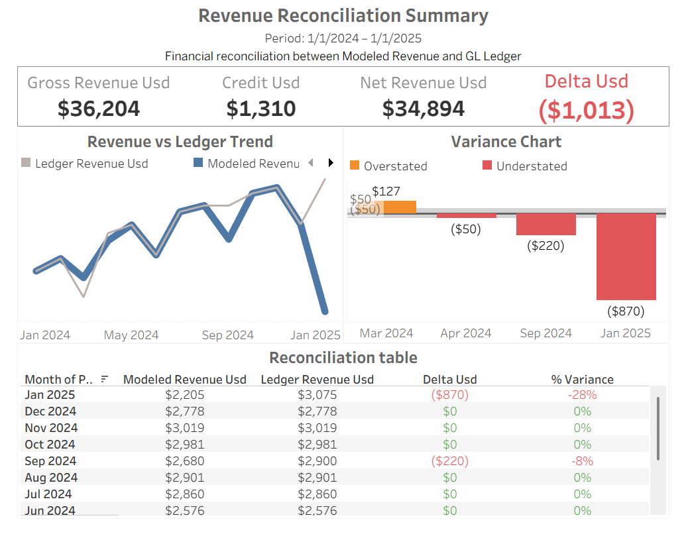
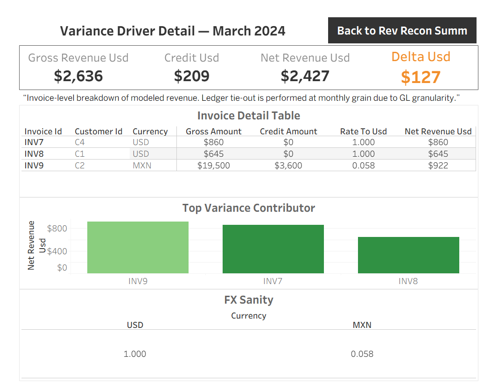

# Revenue Reconciliation dbt Project

## Problem
Finance teams need a trusted bridge between operational invoices and the GL. This project reconciles modeled revenue to ledger revenue and flags variances.

## Solution
A medallion-style dbt project with FX conversion, invoice-level reconciliation, and monthly GL tie-out. Outputs are ready for Tableau.

## Stack
- dbt Core
- Postgres
- Docker Compose
- Tableau (consumption layer)

## Data Flow
- Bronze: standardize raw invoices, credits, FX, and GL ledger.
- Silver: convert invoices and credits to USD.
- Gold: invoice-level fact + monthly reconciliation.

## Key Models
- Bronze: stg_invoices, stg_credit_notes, stg_fx_rates, stg_gl_ledger
- Silver: int_revenue_base, int_credit_agg
- Gold: fct_revenue, fct_revenue_recon_detail, audit_revenue_vs_ledger

## Key Tests / Controls
- FX coverage for non-USD invoices
- Net local math validation (gross - credits = net)
- Non-negative net revenue
- Reconciliation tolerance check
- FX rate bounds and currency consistency

## Edge Cases Simulated
- Missing FX rate for a currency/date (intentional failure)
- Multiple FX rates per date/currency (resolved by latest loaded_at)
- Weekend/holiday date with no FX rate (intentional failure)
- Very small amounts to expose rounding behavior
- Credit note currency different from invoice currency (intentional failure)
- Negative invoice/reversal entry
- Currency code casing (usd vs USD) (intentional failure)

Run only edge-case tests:
```bash
docker compose run --rm dbt dbt test --select tag:edge_cases
```

Run the happy path (exclude edge cases):
```bash
docker compose run --rm dbt dbt test --exclude tag:edge_cases
```

## Tableau Layer
- Connect to Postgres and use the Gold models for dashboards.
- Revenue Reconciliation Summary 
- Invoice Detail 

## BI Lineage & Consumption
- Tableau dashboard exposure is defined in dbt and linked to the gold models.
- Generate docs to view lineage from sources -> models -> Tableau.

## Proof Points
- Dockerized runtime with reproducible environment
- Incremental fact model (`fct_revenue`)
- Source freshness checks
- Multi-currency edge case seeds
- Reconciliation tolerance logic

## Repo Map
- /models: dbt models (bronze, silver, gold)
- /seeds: CSV seed data for raw sources
- /tests: singular tests for quality controls
- /macros: project macros and helpers

## How To Run
```bash
docker compose up --build
docker compose run --rm dbt dbt seed
docker compose run --rm dbt dbt build
docker compose run --rm dbt dbt test --exclude tag:edge_cases
docker compose run --rm dbt dbt source freshness
```

Note: Freshness checks will report STALE because the seed data is historical (2024-2025). This is expected for the demo dataset.

## Source Freshness
```bash
docker compose run --rm dbt dbt source freshness
```
Freshness uses the loaded_at timestamp added to each seed source.

## Historical FX Tracking
FX rates are tracked with an SCD2 snapshot. Use it for point-in-time reporting.

```bash
docker compose run --rm dbt dbt snapshot
```

To make models read from the snapshot (current rows), pass a variable:
```bash
docker compose run --rm dbt dbt build --vars "{use_fx_snapshot: true}"
```

## Tableau Connection
- Host: 127.0.0.1
- Port: 5433
- Database: analytics
- User: postgres
- Password: postgres
- Schema: analytics

## 2-Minute Walkthrough (Script)
"I built a revenue reconciliation pipeline in dbt that standardizes invoice, credit, FX, and GL data in bronze, converts everything to USD in silver, and produces invoice-level and monthly reconciliation in gold. The `fct_revenue` model is incremental for scale, and I added tests for FX coverage, math integrity, and reconciliation tolerance. Source freshness checks show data staleness, which is expected because the seeds are historical. The gold models power Tableau dashboards so finance can see variances and drill down to invoice detail."

## Assumptions & Limitations
- FX rates are daily and present for all non-USD transactions; missing rates will default to 1 in modeling.
- Rounding is handled via numeric casts; minor rounding deltas can occur.
- Tolerance logic uses absolute delta thresholds and may need tuning per business.
- Incremental predicate uses invoice_date as a proxy for change capture.

## What I’d Do Next
- Add late-arriving data buffer for incremental loads.
- Implement snapshots for GL adjustments.
- Add CI to run dbt tests on pull requests.
