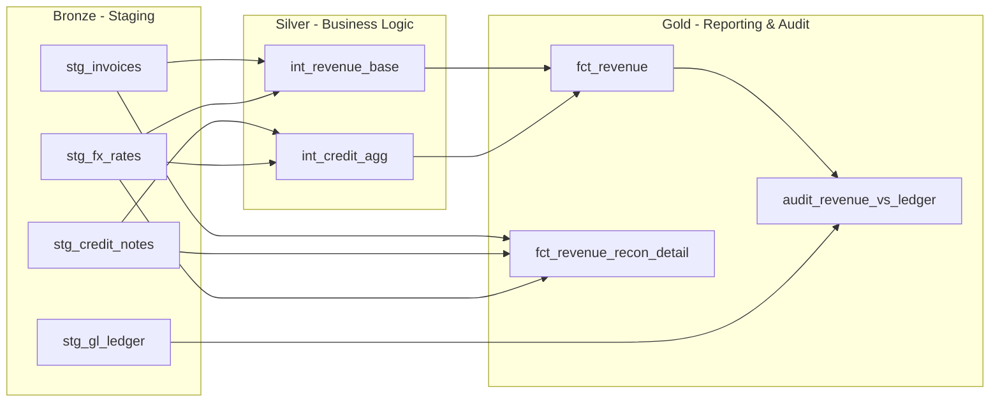

# Revenue Reconciliation dbt Project

## Overview
This project models finance reporting data using dbt on Postgres, with CSV seeds simulating ERP and GL source systems. Outputs are designed to be auditable and consumable in Tableau.

## Data Sources (Seeds)
- Invoices
- Credit Notes
- FX Rates
- GL Ledger

## Architecture

### Bronze – Staging
Standardized financial entities:
- stg_invoices
- stg_credit_notes
- stg_fx_rates
- stg_gl_ledger

### Silver – Business Logic
- int_revenue_base  
  Converts invoice revenue to USD using FX rates.

- int_credit_agg  
  Aggregates credit adjustments and converts to USD.

### Gold – Reporting & Audit
- fct_revenue  
  Net revenue fact table.

- fct_revenue_recon_detail  
  Invoice-level reconciliation drivers.

- audit_revenue_vs_ledger  
  Period-level comparison between operational revenue and GL revenue.

## Financial Controls (Singular Tests)

### FX Coverage
Ensures all transactions have matching FX rates.

### Net Local Math
Validates: gross − credits = net (local currency).

### Non-Negative Revenue
Prevents over-applied credits or duplication anomalies.

### Reconciliation Tolerance
Compares modeled revenue vs GL revenue and flags variances beyond tolerance thresholds.

## Execution

Run locally:

    dbt seed
    dbt build

## Docker

Build and run with Docker Compose:

    docker compose up --build

To run dbt commands manually inside the container:

    docker compose run --rm dbt dbt seed
    docker compose run --rm dbt dbt build

Configuration is provided via environment variables. See [.env.example](../.env.example).

## Useful Commands

Postgres (Docker):

  docker compose up -d
  Starts the Postgres container in the background.

  docker compose exec postgres psql -U postgres -c "\l"
  Lists databases in the Postgres server.

  docker compose exec postgres psql -U postgres -c "create database analytics;"
  Creates the analytics database if it does not exist.

  docker compose exec postgres psql -U postgres -d analytics -c "select * from analytics.fct_revenue limit 10;"
  Validates data access by previewing the revenue fact table.

dbt (Docker):

  docker compose run --rm dbt dbt seed
  Loads CSV seeds into the raw schema.

  docker compose run --rm dbt dbt build
  Runs models, tests, and snapshots in one command.

  docker compose run --rm dbt dbt test
  Executes tests only.

  docker compose run --rm dbt dbt docs generate
  Builds dbt docs artifacts in the target folder.

  docker compose run --rm -p 8080:8080 dbt dbt docs serve --host 0.0.0.0 --port 8080
  Serves dbt docs at http://localhost:8080.

